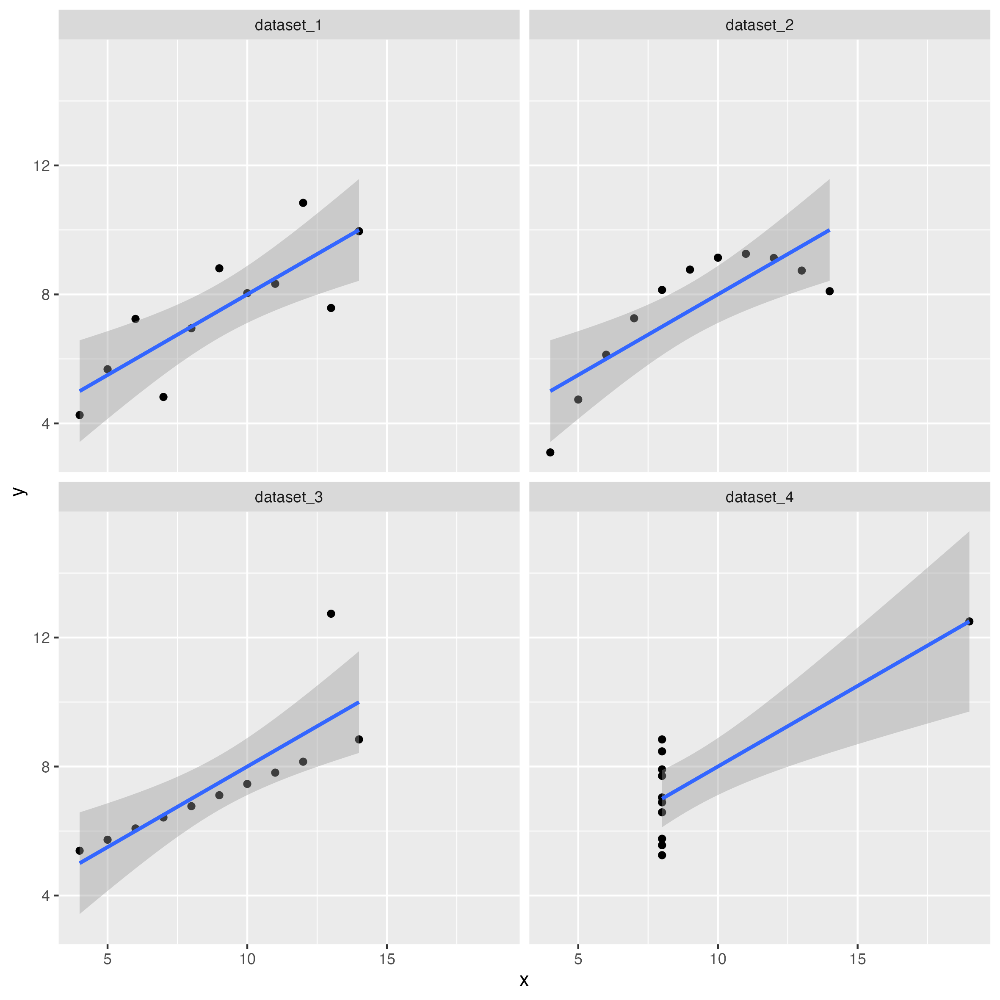
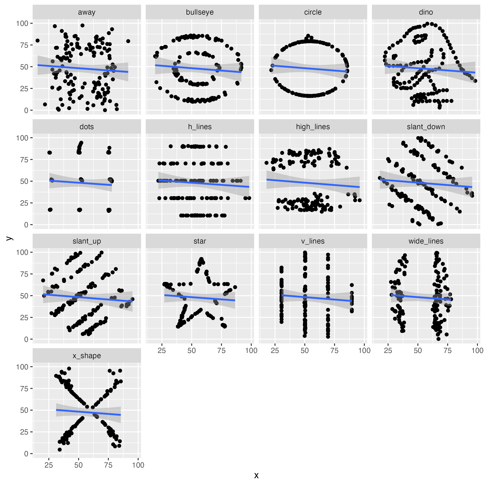

# **Anscombe Dataset**

-   Load Packages and Explore Dataset

```         
library(tidyverse) 
anscombe_quartet = readRDS("../datasets/anscombe_quartet.rds") str(anscombe_quartet) 
```

### What does the function str() do?

str function displays the structure of a dataset, an alternative to summary

-   Summary Statistics

```         
anscombe_quartet %\>% 
  group_by(dataset) %\>% 
  summarise(mean_x = mean(x), mean_y = mean(y), min_x = min(x), min_y = min(y), max_x = max(x), max_y = max(y), crrltn = cor(x, y) )

markdown_table1<-knitr::kable(summary_stats, format = "markdown")
cat(markdown_table1)
```

-   Result

| dataset   | mean_x |   mean_y | min_x | min_y | max_x | max_y |    crrltn |
|-----------|-------:|---------:|------:|------:|------:|------:|----------:|
| dataset_1 |      9 | 7.500909 |     4 |  4.26 |    14 | 10.84 | 0.8164205 |
| dataset_2 |      9 | 7.500909 |     4 |  3.10 |    14 |  9.26 | 0.8162365 |
| dataset_3 |      9 | 7.500000 |     4 |  5.39 |    14 | 12.74 | 0.8162867 |
| dataset_4 |      9 | 7.500909 |     8 |  5.25 |    19 | 12.50 | 0.8165214 |

### What do the summary statistics tell us about the different datasets?

The summary statistics show the means, minimums, maximums and correlation coefficients of x and y values for each of the four datasets. There seem to be positive correlations in all datasets.

-   Plot the dataset

```         
ggplot(anscombe_quartet, aes(x=x,y=y)) + geom_point() + geom_smooth(method = "lm",formula = "y \~ x") + facet_wrap(\~dataset)
```

-   Save the plot

```         
ggsave("anscombe_quartet.png", width = 20, height = 20, units = "cm")
```



### What do the plots tell us about the different datasets?

The distribution of data points in the four datasets are different. Data in the first and the third datasets are linear, but the first dataset has a larger variance (than the third dataset). dataset 2 is a polynormial and dataset 4 all values are the same except for one outlier.

### Describe the relationship between x and y in the different datasets

Positive correlation in dataset 1 and 3, polynormial in dataset 2, pseudo-correlation in dataset 4

### Would linear regression be an appropriate statistical model to analyse the x-y relationship in each dataset?

Linear regression would be appropriate for analyzing dataset 1 and 3 but not 2 and 4

### What conclusions can you draw for the plots and summary statistics?

Distribution of data within each dataset is not consistent with the summary statistics. Dataset 1 and 3 show linear positive correlations, but dataset 2 and 4 are non-linear distributions. So we cannot infer the distribution of a whole dataset based only on its summary statistics.

# **Datasaurus Dataset**

-   Explore Dataset

```         
library(tidyverse) datasaurus_dozen \<- readRDS("../datasets/datasaurus_dozen.rds")

glimpse(datasaurus_dozen)
```

### How many rows and columns does the datasaurus_dozen file have?

1846 rows and 3 columns

-   Plot the dataset

```         
ggplot(datasaurus_dozen, aes(x=x, y=y)) + 
  geom_point() + geom_smooth(method = "lm", formula = "y\~x")
```

-   Calculate the correlations and summary statistics for x and y in all datasets

```         
datasaurus_dozen %\>% 
  group_by(dataset) %\>% 
  summarise(mean_x = mean(x), mean_y = mean(y), max_x = max(x), max_y = max(y), min_x = min(x), min_y = min(y), cor_x.y = cor(y,x) )

markdown_table2<-knitr::kable(summary_stats2, format = "markdown")
cat(markdown_table2)
```

-   Result

| dataset    |   mean_x |   mean_y |    max_x |    max_y |    min_x |      min_y |    cor_x.y |
|:--------|--------:|--------:|--------:|--------:|--------:|--------:|--------:|
| away       | 54.26610 | 47.83472 | 91.63996 | 97.47577 | 15.56075 |  0.0151193 | -0.0641284 |
| bullseye   | 54.26873 | 47.83082 | 91.73554 | 85.87623 | 19.28820 |  9.6915471 | -0.0685864 |
| circle     | 54.26732 | 47.83772 | 85.66476 | 85.57813 | 21.86358 | 16.3265464 | -0.0683434 |
| dino       | 54.26327 | 47.83225 | 98.20510 | 99.48720 | 22.30770 |  2.9487000 | -0.0644719 |
| dots       | 54.26030 | 47.83983 | 77.95444 | 94.24933 | 25.44353 | 15.7718920 | -0.0603414 |
| h_lines    | 54.26144 | 47.83025 | 98.28812 | 90.45894 | 22.00371 | 10.4639152 | -0.0617148 |
| high_lines | 54.26881 | 47.83545 | 96.08052 | 87.15221 | 17.89350 | 14.9139625 | -0.0685042 |
| slant_down | 54.26785 | 47.83590 | 95.59342 | 99.64418 | 18.10947 |  0.3038724 | -0.0689797 |
| slant_up   | 54.26588 | 47.83150 | 95.26053 | 99.57959 | 20.20978 |  5.6457775 | -0.0686092 |
| star       | 54.26734 | 47.83955 | 86.43590 | 92.21499 | 27.02460 | 14.3655905 | -0.0629611 |
| v_lines    | 54.26993 | 47.83699 | 89.50485 | 99.69468 | 30.44965 |  2.7347602 | -0.0694456 |
| wide_lines | 54.26692 | 47.83160 | 77.91587 | 99.28376 | 27.43963 |  0.2170063 | -0.0665752 |
| x_shape    | 54.26015 | 47.83972 | 85.44619 | 97.83761 | 31.10687 |  4.5776614 | -0.0655833 |

-   Plot the relationships between x and y in each dataset including the line of best fit

```         
ggplot(datasaurus_dozen, aes(x=x, y=y)) + geom_point() + geom_smooth(method = "lm", formula = "y\~x") + facet_wrap(\~dataset)
```

-   Save the plot

```         
ggsave("datasaurus.png", width = 20, height = 20, unit = "cm")
```



### What conclusions can you draw for the plots and summary statistics?

Even though all datasets have negative correlations, the distribution of data points in none of the dataset is linear. Therefore, presence of significant correlation might not capture the distribution of the whole dataset, careful check of the distribution of the whole dataset is necessary before any further analysis.
